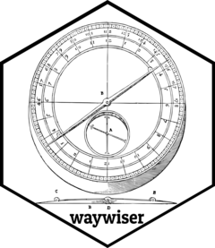
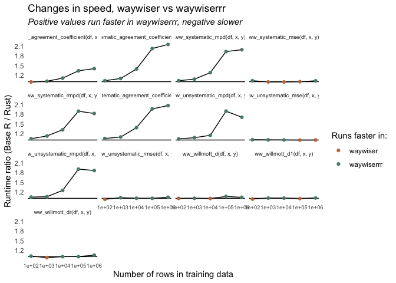

<!-- README.md is generated from README.Rmd. Please edit that file -->

# waywiserrr <a href="https://docs.ropensci.org/waywiser/"></a>

waywiserrr is [waywise**r**](https://docs.ropensci.org/waywiser/),
**r**ewritten in **R**ust. I’m using this repo to experiment with using
Rust in R packages, and to try and muddle my way through learning
ndarray.

You probably shouldn’t use this; this repo forked from waywiser a while
back, with most bug fixes and feature additions put into the main repo.
I’m also not particularly likely to port any of this code into the main
repo, as the speedups don’t yet justify the headache of maintaining a
package with compiled code (or, in particular, maintaining a package
with Rust code).

## Comparisons

``` r
benchmarks <- bench::press(
  rows = 10^(2:6),
  {
    df <- withr::with_seed(
      1107,
      data.frame(x = rnorm(rows), y = rnorm(rows))
    )
    bench::mark(
      waywiser::ww_agreement_coefficient(df, x, y),
      waywiserrr::ww_agreement_coefficient(df, x, y),
      waywiser::ww_systematic_agreement_coefficient(df, x, y),
      waywiserrr::ww_systematic_agreement_coefficient(df, x, y),
      waywiser::ww_unsystematic_agreement_coefficient(df, x, y),
      waywiserrr::ww_unsystematic_agreement_coefficient(df, x, y),
      waywiser::ww_unsystematic_mpd(df, x, y),
      waywiserrr::ww_unsystematic_mpd(df, x, y),
      waywiser::ww_systematic_mpd(df, x, y),
      waywiserrr::ww_systematic_mpd(df, x, y),
      waywiser::ww_unsystematic_rmpd(df, x, y),
      waywiserrr::ww_unsystematic_rmpd(df, x, y),
      waywiser::ww_systematic_rmpd(df, x, y),
      waywiserrr::ww_systematic_rmpd(df, x, y),
      waywiser::ww_willmott_d(df, x, y),
      waywiserrr::ww_willmott_d(df, x, y),
      waywiser::ww_willmott_d1(df, x, y),
      waywiserrr::ww_willmott_d1(df, x, y),
      waywiser::ww_willmott_dr(df, x, y),
      waywiserrr::ww_willmott_dr(df, x, y),
      waywiser::ww_systematic_mse(df, x, y),
      waywiserrr::ww_systematic_mse(df, x, y),
      waywiser::ww_unsystematic_mse(df, x, y),
      waywiserrr::ww_unsystematic_mse(df, x, y),
      waywiser::ww_unsystematic_rmse(df, x, y),
      waywiserrr::ww_unsystematic_rmse(df, x, y),
      check = FALSE,
      min_iterations = 10,
      filter_gc = FALSE
    )
  }
)

library(ggplot2)
benchmarks |> 
  dplyr::mutate(
    expression = as.character(expression),
    median = as.numeric(median)
  ) |> 
  tidyr::separate_wider_delim(
    "expression", "::", names = c("package", "func")
  ) |> 
  dplyr::arrange(rows, func, package) |> 
  dplyr::group_by(rows, func) |> 
  dplyr::summarise(
    ratio = median[1] / median[2],
    .groups = "drop"
  ) |> 
  ggplot() +
  aes(x = rows, y = ratio) + 
  geom_abline(slope = 0, intercept = 1, linesize = 0.2) +
  geom_line(linewidth = .5) +
  geom_point(aes(color = ratio > 1)) +
  scale_x_log10() +
  scale_color_manual(
    "Runs faster in:",
    labels = c("waywiser", "waywiserrr"),
    values = c("#c5784f", "#588d75")
  ) +
  labs(
    x = "Number of rows in training data",
    y = "Runtime ratio (Base R / Rust)",
    title = "Changes in speed, waywiser vs waywiserrr",
    subtitle = "Positive values run faster in waywiserrr, negative slower"
  ) +
  theme_minimal() +
  theme(
    plot.subtitle = element_text(face = "italic"),
    panel.grid = element_blank(),
    strip.text = element_text(size = 7),
    axis.text.x = element_text(size = 7)
  ) +
  facet_wrap(~ func)
```



``` r

print(
  benchmarks[c("expression", "rows", "median")],
  n = 999
)
#> # A tibble: 130 × 3
#>     expression                                                     rows   median
#>     <bch:expr>                                                    <dbl> <bch:tm>
#>   1 waywiser::ww_agreement_coefficient(df, x, y)                    100  684.5µs
#>   2 waywiserrr::ww_agreement_coefficient(df, x, y)                  100 690.48µs
#>   3 waywiser::ww_systematic_agreement_coefficient(df, x, y)         100 740.38µs
#>   4 waywiserrr::ww_systematic_agreement_coefficient(df, x, y)       100 718.57µs
#>   5 waywiser::ww_unsystematic_agreement_coefficient(df, x, y)       100 732.42µs
#>   6 waywiserrr::ww_unsystematic_agreement_coefficient(df, x, y)     100 699.91µs
#>   7 waywiser::ww_unsystematic_mpd(df, x, y)                         100 724.59µs
#>   8 waywiserrr::ww_unsystematic_mpd(df, x, y)                       100  701.3µs
#>   9 waywiser::ww_systematic_mpd(df, x, y)                           100 724.92µs
#>  10 waywiserrr::ww_systematic_mpd(df, x, y)                         100  703.6µs
#>  11 waywiser::ww_unsystematic_rmpd(df, x, y)                        100 724.82µs
#>  12 waywiserrr::ww_unsystematic_rmpd(df, x, y)                      100 697.92µs
#>  13 waywiser::ww_systematic_rmpd(df, x, y)                          100 726.64µs
#>  14 waywiserrr::ww_systematic_rmpd(df, x, y)                        100 698.27µs
#>  15 waywiser::ww_willmott_d(df, x, y)                               100 686.91µs
#>  16 waywiserrr::ww_willmott_d(df, x, y)                             100 687.98µs
#>  17 waywiser::ww_willmott_d1(df, x, y)                              100 685.11µs
#>  18 waywiserrr::ww_willmott_d1(df, x, y)                            100 700.01µs
#>  19 waywiser::ww_willmott_dr(df, x, y)                              100 704.54µs
#>  20 waywiserrr::ww_willmott_dr(df, x, y)                            100 693.68µs
#>  21 waywiser::ww_systematic_mse(df, x, y)                           100   1.17ms
#>  22 waywiserrr::ww_systematic_mse(df, x, y)                         100   1.14ms
#>  23 waywiser::ww_unsystematic_mse(df, x, y)                         100   1.15ms
#>  24 waywiserrr::ww_unsystematic_mse(df, x, y)                       100   1.14ms
#>  25 waywiser::ww_unsystematic_rmse(df, x, y)                        100   1.12ms
#>  26 waywiserrr::ww_unsystematic_rmse(df, x, y)                      100   1.15ms
#>  27 waywiser::ww_agreement_coefficient(df, x, y)                   1000 736.69µs
#>  28 waywiserrr::ww_agreement_coefficient(df, x, y)                 1000 726.81µs
#>  29 waywiser::ww_systematic_agreement_coefficient(df, x, y)        1000 800.52µs
#>  30 waywiserrr::ww_systematic_agreement_coefficient(df, x, y)      1000 728.41µs
#>  31 waywiser::ww_unsystematic_agreement_coefficient(df, x, y)      1000  779.9µs
#>  32 waywiserrr::ww_unsystematic_agreement_coefficient(df, x, y)    1000 713.85µs
#>  33 waywiser::ww_unsystematic_mpd(df, x, y)                        1000  766.6µs
#>  34 waywiserrr::ww_unsystematic_mpd(df, x, y)                      1000 715.14µs
#>  35 waywiser::ww_systematic_mpd(df, x, y)                          1000 773.75µs
#>  36 waywiserrr::ww_systematic_mpd(df, x, y)                        1000 717.29µs
#>  37 waywiser::ww_unsystematic_rmpd(df, x, y)                       1000 768.26µs
#>  38 waywiserrr::ww_unsystematic_rmpd(df, x, y)                     1000 731.75µs
#>  39 waywiser::ww_systematic_rmpd(df, x, y)                         1000 816.62µs
#>  40 waywiserrr::ww_systematic_rmpd(df, x, y)                       1000 726.97µs
#>  41 waywiser::ww_willmott_d(df, x, y)                              1000 713.15µs
#>  42 waywiserrr::ww_willmott_d(df, x, y)                            1000 712.09µs
#>  43 waywiser::ww_willmott_d1(df, x, y)                             1000 749.85µs
#>  44 waywiserrr::ww_willmott_d1(df, x, y)                           1000 744.31µs
#>  45 waywiser::ww_willmott_dr(df, x, y)                             1000 708.23µs
#>  46 waywiserrr::ww_willmott_dr(df, x, y)                           1000 728.98µs
#>  47 waywiser::ww_systematic_mse(df, x, y)                          1000   1.18ms
#>  48 waywiserrr::ww_systematic_mse(df, x, y)                        1000   1.18ms
#>  49 waywiser::ww_unsystematic_mse(df, x, y)                        1000   1.19ms
#>  50 waywiserrr::ww_unsystematic_mse(df, x, y)                      1000   1.18ms
#>  51 waywiser::ww_unsystematic_rmse(df, x, y)                       1000   1.23ms
#>  52 waywiserrr::ww_unsystematic_rmse(df, x, y)                     1000   1.21ms
#>  53 waywiser::ww_agreement_coefficient(df, x, y)                  10000 933.45µs
#>  54 waywiserrr::ww_agreement_coefficient(df, x, y)                10000 840.56µs
#>  55 waywiser::ww_systematic_agreement_coefficient(df, x, y)       10000   1.35ms
#>  56 waywiserrr::ww_systematic_agreement_coefficient(df, x, y)     10000 969.24µs
#>  57 waywiser::ww_unsystematic_agreement_coefficient(df, x, y)     10000   1.31ms
#>  58 waywiserrr::ww_unsystematic_agreement_coefficient(df, x, y)   10000 951.28µs
#>  59 waywiser::ww_unsystematic_mpd(df, x, y)                       10000   1.26ms
#>  60 waywiserrr::ww_unsystematic_mpd(df, x, y)                     10000    1.1ms
#>  61 waywiser::ww_systematic_mpd(df, x, y)                         10000   1.31ms
#>  62 waywiserrr::ww_systematic_mpd(df, x, y)                       10000   1.03ms
#>  63 waywiser::ww_unsystematic_rmpd(df, x, y)                      10000   1.23ms
#>  64 waywiserrr::ww_unsystematic_rmpd(df, x, y)                    10000 988.14µs
#>  65 waywiser::ww_systematic_rmpd(df, x, y)                        10000   1.26ms
#>  66 waywiserrr::ww_systematic_rmpd(df, x, y)                      10000  953.5µs
#>  67 waywiser::ww_willmott_d(df, x, y)                             10000 897.24µs
#>  68 waywiserrr::ww_willmott_d(df, x, y)                           10000 902.53µs
#>  69 waywiser::ww_willmott_d1(df, x, y)                            10000 894.87µs
#>  70 waywiserrr::ww_willmott_d1(df, x, y)                          10000 888.43µs
#>  71 waywiser::ww_willmott_dr(df, x, y)                            10000 855.05µs
#>  72 waywiserrr::ww_willmott_dr(df, x, y)                          10000 854.58µs
#>  73 waywiser::ww_systematic_mse(df, x, y)                         10000   1.82ms
#>  74 waywiserrr::ww_systematic_mse(df, x, y)                       10000   1.84ms
#>  75 waywiser::ww_unsystematic_mse(df, x, y)                       10000   1.83ms
#>  76 waywiserrr::ww_unsystematic_mse(df, x, y)                     10000   1.83ms
#>  77 waywiser::ww_unsystematic_rmse(df, x, y)                      10000   1.83ms
#>  78 waywiserrr::ww_unsystematic_rmse(df, x, y)                    10000   1.82ms
#>  79 waywiser::ww_agreement_coefficient(df, x, y)                 100000   2.75ms
#>  80 waywiserrr::ww_agreement_coefficient(df, x, y)               100000   2.06ms
#>  81 waywiser::ww_systematic_agreement_coefficient(df, x, y)      100000   6.71ms
#>  82 waywiserrr::ww_systematic_agreement_coefficient(df, x, y)    100000   3.32ms
#>  83 waywiser::ww_unsystematic_agreement_coefficient(df, x, y)    100000   6.56ms
#>  84 waywiserrr::ww_unsystematic_agreement_coefficient(df, x, y)  100000   3.35ms
#>  85 waywiser::ww_unsystematic_mpd(df, x, y)                      100000    5.7ms
#>  86 waywiserrr::ww_unsystematic_mpd(df, x, y)                    100000   3.01ms
#>  87 waywiser::ww_systematic_mpd(df, x, y)                        100000   5.98ms
#>  88 waywiserrr::ww_systematic_mpd(df, x, y)                      100000    3.1ms
#>  89 waywiser::ww_unsystematic_rmpd(df, x, y)                     100000   5.68ms
#>  90 waywiserrr::ww_unsystematic_rmpd(df, x, y)                   100000   2.99ms
#>  91 waywiser::ww_systematic_rmpd(df, x, y)                       100000   5.95ms
#>  92 waywiserrr::ww_systematic_rmpd(df, x, y)                     100000   3.15ms
#>  93 waywiser::ww_willmott_d(df, x, y)                            100000    2.7ms
#>  94 waywiserrr::ww_willmott_d(df, x, y)                          100000   2.56ms
#>  95 waywiser::ww_willmott_d1(df, x, y)                           100000   2.66ms
#>  96 waywiserrr::ww_willmott_d1(df, x, y)                         100000   2.68ms
#>  97 waywiser::ww_willmott_dr(df, x, y)                           100000   2.37ms
#>  98 waywiserrr::ww_willmott_dr(df, x, y)                         100000   2.36ms
#>  99 waywiser::ww_systematic_mse(df, x, y)                        100000  13.31ms
#> 100 waywiserrr::ww_systematic_mse(df, x, y)                      100000  13.31ms
#> 101 waywiser::ww_unsystematic_mse(df, x, y)                      100000  13.17ms
#> 102 waywiserrr::ww_unsystematic_mse(df, x, y)                    100000   13.2ms
#> 103 waywiser::ww_unsystematic_rmse(df, x, y)                     100000  13.46ms
#> 104 waywiserrr::ww_unsystematic_rmse(df, x, y)                   100000  13.45ms
#> 105 waywiser::ww_agreement_coefficient(df, x, y)                1000000  22.61ms
#> 106 waywiserrr::ww_agreement_coefficient(df, x, y)              1000000  16.12ms
#> 107 waywiser::ww_systematic_agreement_coefficient(df, x, y)     1000000  65.13ms
#> 108 waywiserrr::ww_systematic_agreement_coefficient(df, x, y)   1000000  30.31ms
#> 109 waywiser::ww_unsystematic_agreement_coefficient(df, x, y)   1000000  63.33ms
#> 110 waywiserrr::ww_unsystematic_agreement_coefficient(df, x, y) 1000000   30.7ms
#> 111 waywiser::ww_unsystematic_mpd(df, x, y)                     1000000  52.22ms
#> 112 waywiserrr::ww_unsystematic_mpd(df, x, y)                   1000000  30.66ms
#> 113 waywiser::ww_systematic_mpd(df, x, y)                       1000000  54.98ms
#> 114 waywiserrr::ww_systematic_mpd(df, x, y)                     1000000  27.69ms
#> 115 waywiser::ww_unsystematic_rmpd(df, x, y)                    1000000  53.91ms
#> 116 waywiserrr::ww_unsystematic_rmpd(df, x, y)                  1000000  29.01ms
#> 117 waywiser::ww_systematic_rmpd(df, x, y)                      1000000  53.61ms
#> 118 waywiserrr::ww_systematic_rmpd(df, x, y)                    1000000  29.49ms
#> 119 waywiser::ww_willmott_d(df, x, y)                           1000000  23.11ms
#> 120 waywiserrr::ww_willmott_d(df, x, y)                         1000000   22.4ms
#> 121 waywiser::ww_willmott_d1(df, x, y)                          1000000  22.42ms
#> 122 waywiserrr::ww_willmott_d1(df, x, y)                        1000000  22.17ms
#> 123 waywiser::ww_willmott_dr(df, x, y)                          1000000  20.34ms
#> 124 waywiserrr::ww_willmott_dr(df, x, y)                        1000000  19.43ms
#> 125 waywiser::ww_systematic_mse(df, x, y)                       1000000 108.22ms
#> 126 waywiserrr::ww_systematic_mse(df, x, y)                     1000000 105.34ms
#> 127 waywiser::ww_unsystematic_mse(df, x, y)                     1000000 108.27ms
#> 128 waywiserrr::ww_unsystematic_mse(df, x, y)                   1000000 108.32ms
#> 129 waywiser::ww_unsystematic_rmse(df, x, y)                    1000000 109.95ms
#> 130 waywiserrr::ww_unsystematic_rmse(df, x, y)                  1000000 106.45ms
```
